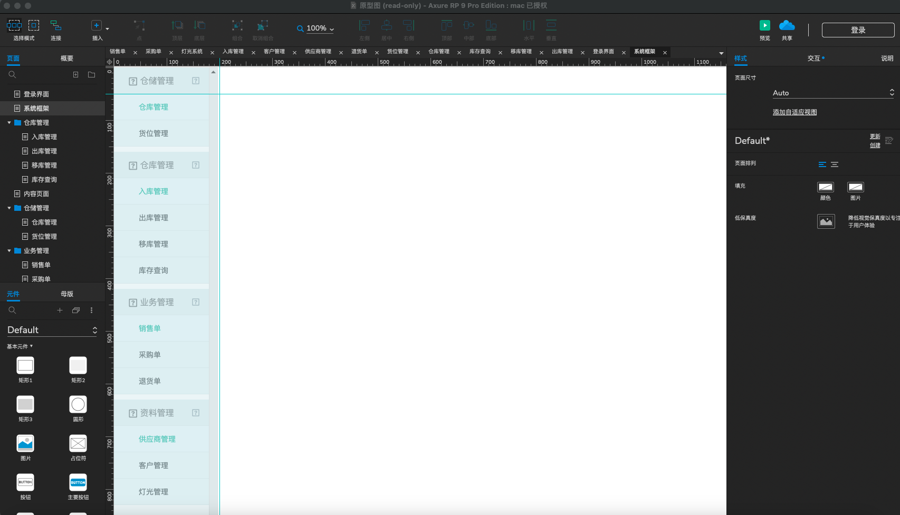

### 基于亮灯的出入库管理系统
在真实的仓储环境中，后端管理界面可以通过物联网技术同电子板、仓位指示灯等进行交互，出于学习目的，我们尽可能对这一过程进行模仿抽象，该项目严格遵守MVC架构，也是笔者的入门代码。由于服务器过期，下面展示最初的原型界面。该项目最初于2021年上传于gitee，现整理后转存到github。
#### 技术路线
MVC+MYSQL+Easyui 
2021年的课程作业，入门学习。
#### 界面展示

